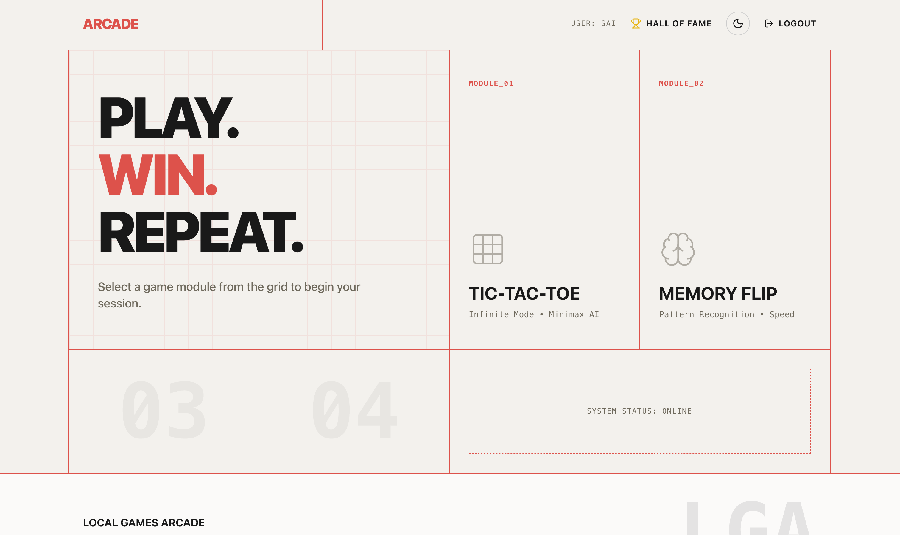
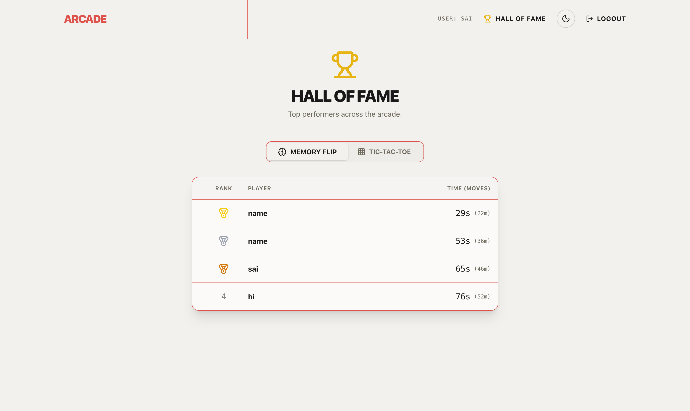

# Local Games Arcade

A unified arcade platform combining **Memory Card Flip** and **Infinite Tic-Tac-Toe** into a single modern web application.

## 🎮 Games

1.  **Memory Card Flip**: Test your memory by matching pairs of cards against the clock. Features multiple difficulty levels and a persistent leaderboard.
2.  **Tic-Tac-Toe (Infinite)**: A twist on the classic game. You can only have 3 pieces on the board at once; placing a 4th removes your oldest piece. Play against a Minimax AI or a friend.
3.  **2048**: Use arrow keys to merge tiles and reach the number 2048.
4.  **Block Blast**: A Tetris-style falling block puzzle. Clear 10x20 grid lines to score points.

## 🛠️ Tech Stack

-   **Backend**: Go (Golang), Chi Router, SQLite, JWT Auth.
-   **Frontend**: React, Vite, TypeScript, Tailwind CSS v4, Framer Motion, Zustand.
-   **Package Manager**: Bun (Frontend).

## 🚀 Getting Started

### Prerequisites

-   [Go](https://go.dev/dl/) (v1.23+)
-   [Bun](https://bun.sh/) (v1.0+)

### Installation

1.  Clone the repository.
2.  Create a `.env` file in the root directory (see `.env.example`):
    ```bash
    JWT_SECRET=your_secure_secret
    ```
3.  Install dependencies:
    ```bash
    make install
    ```

### Running the App

You will need two terminal windows to run the full stack (or use a tool like `concurrently` if you prefer).

**Terminal 1: Backend**
```bash
make dev-backend
```
Server runs on `http://localhost:8080`.

**Terminal 2: Frontend**
```bash
make dev-frontend
```
Frontend runs on `http://localhost:5173`.

## 📂 Project Structure

-   `backend_shared/`: The Go API server.
-   `frontend_shared/`: The React client.

## 📸 Gallery

<p align="center">
  
  
</p>
<p align="center">
  
</p>

## ✨ Features

-   **Shared Auth**: Secure PIN-based entry with JWT sessions.
-   **Unified Dashboard**: Select your game from a sleek, arcade-style home screen.
-   **Security**: Manage your PIN and Hint directly from the dashboard settings.
-   **Responsive Design**: Optimized for both desktop and mobile play.

## 🔒 Security

This project includes built-in security scanning using [Trivy](https://aquasecurity.github.io/trivy/).

To scan the built Docker images:
```bash
make scan-backend
make scan-frontend
```

To scan the source code/filesystem:
```bash
make scan-fs
```

## 🤝 Contributing

Interested in contributing? Please read our [Contributing Guide](CONTRIBUTING.md) for details on our code of conduct and the process for submitting pull requests.
